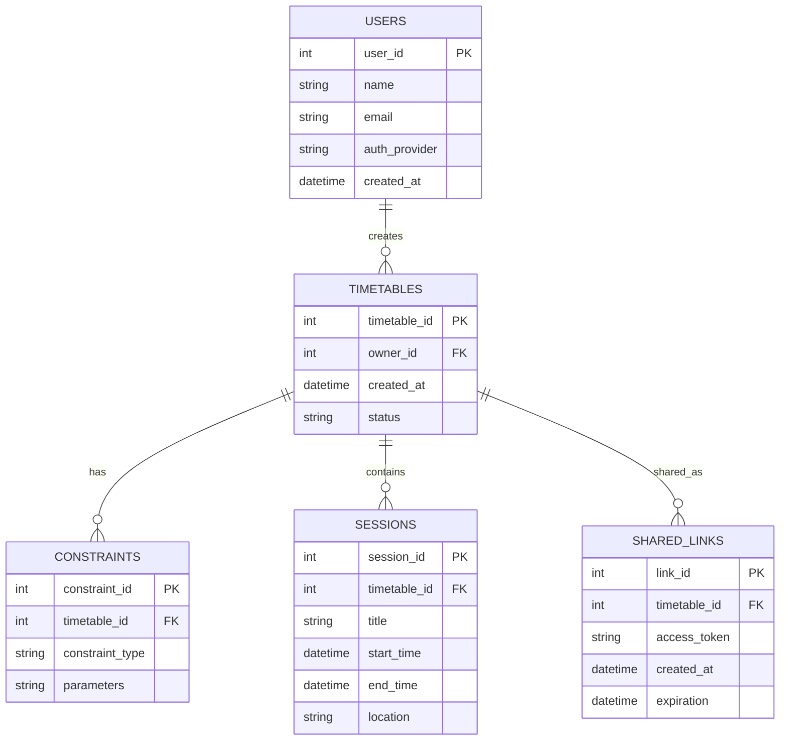

# ER Diagram — Timetable3o

## Overview

This diagram represents the logical database structure for the Timetable3o system. It models the entities required to store users, generated timetables, scheduling constraints, sessions, and sharing information.

The design focuses on persistent data rather than internal processing components.

---

## Entities

### USERS

Stores information about authenticated users.

Attributes:

* user_id (PK)
* name
* email
* auth_provider
* created_at

Notes:
Unregistered visitors may use the system without a database record.

---

### TIMETABLES

Represents generated schedules.

Attributes:

* timetable_id (PK)
* owner_id (FK → USERS.user_id, nullable)
* created_at
* status (feasible / infeasible)

Notes:
Timetables may exist without an owner if created anonymously.

---

### CONSTRAINTS

Stores constraints associated with a timetable.

Attributes:

* constraint_id (PK)
* timetable_id (FK → TIMETABLES.timetable_id)
* constraint_type
* parameters (structured data)

---

### SESSIONS

Represents individual scheduled entries in a timetable.

Attributes:

* session_id (PK)
* timetable_id (FK → TIMETABLES.timetable_id)
* title
* start_time
* end_time
* location
* assigned_resource

---

### SHARED_LINKS

Allows timetables to be shared publicly.

Attributes:

* link_id (PK)
* timetable_id (FK → TIMETABLES.timetable_id)
* access_token
* created_at
* expiration (optional)

---

### EXPORT_RECORDS (Optional)

Tracks export actions to external services.

Attributes:

* export_id (PK)
* timetable_id (FK → TIMETABLES.timetable_id)
* export_type (Calendar / Sheets)
* exported_at

---

## Relationships

* USERS 1 — M TIMETABLES
  A user may create multiple timetables.

* TIMETABLES 1 — M CONSTRAINTS
  Each timetable is generated from multiple constraints.

* TIMETABLES 1 — M SESSIONS
  A timetable consists of multiple scheduled sessions.

* TIMETABLES 1 — M SHARED_LINKS
  A timetable may have multiple public links.

* TIMETABLES 1 — M EXPORT_RECORDS
  A timetable may be exported multiple times.

---

## Notes

This schema supports both anonymous timetable generation and authenticated usage with persistence, sharing, and export capabilities.
