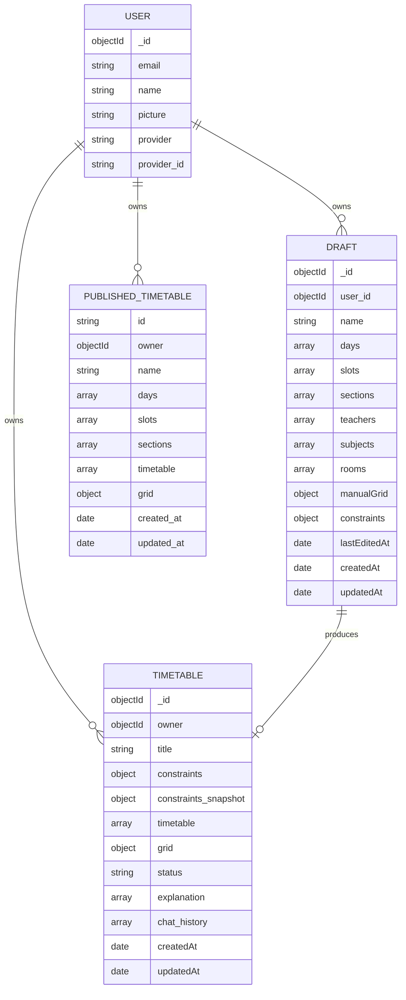

# ER Diagram

```mermaid
erDiagram
    USER ||--o{ DRAFT : owns
    USER ||--o{ TIMETABLE : owns
    USER ||--o{ PUBLISHED_TIMETABLE : owns
    DRAFT ||--o| TIMETABLE : produces

    USER {
        objectId _id
        string email
        string name
        string picture
        string provider
        string provider_id
    }

    DRAFT {
        objectId _id
        objectId user_id
        string name
        array days
        array slots
        array sections
        array teachers
        array subjects
        array rooms
        object manualGrid
        object constraints
        date lastEditedAt
        date createdAt
        date updatedAt
    }

    TIMETABLE {
        objectId _id
        objectId owner
        string title
        object constraints
        object constraints_snapshot
        array timetable
        object grid
        string status
        array explanation
        array chat_history
        date createdAt
        date updatedAt
    }

    PUBLISHED_TIMETABLE {
        string id
        objectId owner
        string name
        array days
        array slots
        array sections
        array timetable
        object grid
        date created_at
        date updated_at
    }
```

## Notes
- `Draft` stores the editable working state for timetable creation.
- `Timetable` stores saved timetable records and snapshots.
- `PublishedTimetable` stores frozen, shareable timetable snapshots.
- Subjects, slots, sections, teachers, and rooms are embedded inside `Draft` as structured arrays/objects rather than separate relational tables, which matches the MongoDB implementation.
