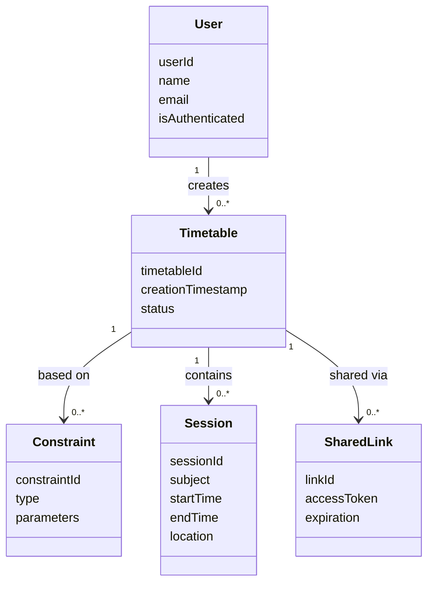

# Class Diagram — Timetable3o

## Overview

This diagram represents the conceptual structure of the Timetable3o system, focusing on the primary entities involved in timetable generation, management, and export.

The diagram models key data objects and system components rather than specific implementation details.

---

## Core Classes / Entities

### User

Represents a platform user.

Attributes:

* userId
* name
* email
* isAuthenticated

Responsibilities:

* Create timetable sessions
* Save timetables (if authenticated)
* Share or export timetables

---

### Timetable

Represents a generated schedule.

Attributes:

* timetableId
* creationTimestamp
* ownerId (optional)
* status (feasible / infeasible)

Responsibilities:

* Store scheduled sessions
* Support viewing and exporting
* Maintain association with constraints

---

### Constraint

Represents a scheduling requirement provided by the user.

Attributes:

* constraintId
* type (time, room, availability, etc.)
* parameters

Responsibilities:

* Define rules that the timetable must satisfy

---

### Session (Time Slot Entry)

Represents an individual scheduled item.

Attributes:

* sessionId
* subject
* startTime
* endTime
* location
* assignedResource

Responsibilities:

* Represent a single timetable block

---

### AIProcessor

Handles interpretation of user input.

Responsibilities:

* Extract structured constraints from chat input
* Provide feedback when constraints are invalid or incomplete

---

### SolverService

Responsible for timetable generation.

Responsibilities:

* Receive constraints
* Attempt schedule generation
* Return feasible timetable or conflict information

---

### ValidationService (Future Component)

Checks timetable validity after manual changes.

Responsibilities:

* Detect conflicts
* Verify constraint satisfaction

---

### ExportService

Handles exporting timetables to external platforms.

Responsibilities:

* Convert timetable into required formats
* Send data to external services

---

### SharedLink

Represents a publicly accessible timetable link.

Attributes:

* linkId
* timetableId
* accessToken
* expiration (optional)

Responsibilities:

* Allow non-registered users to view shared timetables

---

## Relationships

* A User may create multiple Timetables
* A Timetable contains multiple Sessions
* A Timetable is generated based on multiple Constraints
* AIProcessor extracts Constraints from user input
* SolverService uses Constraints to produce a Timetable
* ExportService operates on Timetable data
* SharedLink references a specific Timetable

---

## Notes

The diagram reflects a conceptual system design and does not assume a specific programming paradigm or implementation style.
