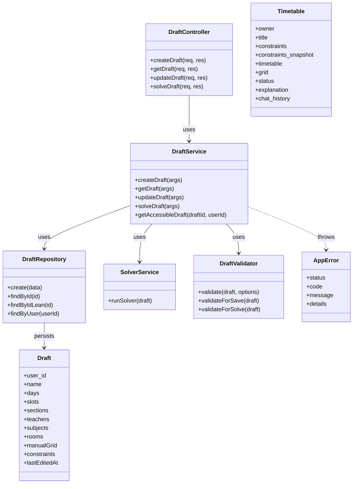

# Class Diagram

```mermaid
classDiagram
    class DraftController {
        +createDraft(req, res)
        +getDraft(req, res)
        +updateDraft(req, res)
        +solveDraft(req, res)
    }

    class DraftService {
        +createDraft(args)
        +getDraft(args)
        +updateDraft(args)
        +solveDraft(args)
        +getAccessibleDraft(draftId, userId)
    }

    class DraftRepository {
        +create(data)
        +findById(id)
        +findByIdLean(id)
        +findByUser(userId)
    }

    class SolverService {
        +runSolver(draft)
    }

    class DraftValidator {
        +validate(draft, options)
        +validateForSave(draft)
        +validateForSolve(draft)
    }

    class AppError {
        +status
        +code
        +message
        +details
    }

    class Draft {
        +user_id
        +name
        +days
        +slots
        +sections
        +teachers
        +subjects
        +rooms
        +manualGrid
        +constraints
        +lastEditedAt
    }

    class Timetable {
        +owner
        +title
        +constraints
        +constraints_snapshot
        +timetable
        +grid
        +status
        +explanation
        +chat_history
    }

    DraftController --> DraftService : uses
    DraftService --> DraftRepository : uses
    DraftService --> DraftValidator : uses
    DraftService --> SolverService : uses
    DraftRepository --> Draft : persists
    DraftService ..> AppError : throws
```

## Notes
This diagram reflects the actual backend design used in the draft workflow. The controller delegates all core work to the service layer. The service layer validates data, enforces access rules, and invokes the solver. The repository isolates database access through Mongoose models.
