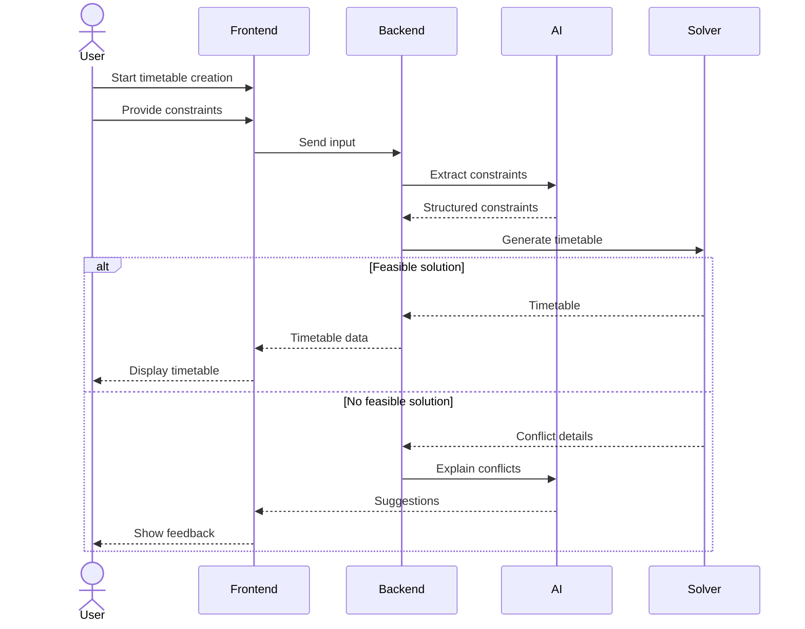

# Sequence Diagram — Timetable3o

## Scenario: Timetable Generation Flow

This diagram represents the interaction between the user, system components, and external services during timetable creation.

---

## Actors / Components

* User (Visitor or Registered User)
* Frontend Interface (Chat + Timetable View)
* Backend Server
* AI Component (Constraint Extraction)
* Solver Service (Constraint Solver using OR-Tools)
* Export Services (Google Calendar / Google Sheets — optional)

---

## Main Flow (Feasible Timetable)

1. User opens the platform and starts timetable creation.
2. User provides scheduling requirements through the chat interface.
3. Frontend sends user input to the backend.
4. Backend forwards input to the AI component.
5. AI extracts structured constraints from the input.
6. Extracted constraints are returned to the backend.
7. Backend sends constraints to the solver service.
8. Solver attempts to generate a valid timetable.
9. Solver returns a feasible timetable.
10. Backend stores (if user is authenticated) and forwards the result to the frontend.
11. Frontend renders the timetable in a calendar-style layout.
12. User views the generated timetable.

---

## Alternative Flow (No Feasible Solution)

If the solver cannot generate a valid timetable:

1. Solver returns failure information and conflicting constraints.
2. Backend forwards this information to the AI component.
3. AI generates an explanation or suggestions for relaxing constraints.
4. Frontend displays the feedback in the chat interface.
5. User modifies constraints and resubmits.

---

## Optional Actions After Generation

If the user is authenticated:

* Save timetable
* Share timetable via public link
* Export timetable to Google Calendar
* Export timetable to Google Sheets

Export actions involve sending timetable data to the respective external services.

---

## Notes

The system supports iterative interaction, allowing users to refine constraints until a feasible timetable is produced.

