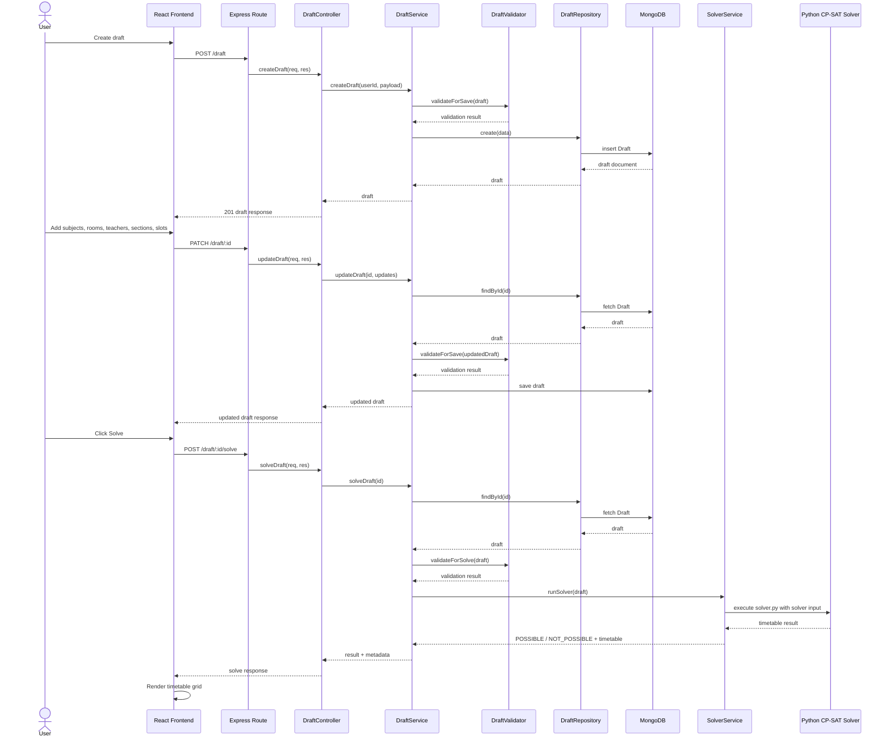

# Sequence Diagram

```mermaid
sequenceDiagram
    actor User
    participant FE as React Frontend
    participant API as Express Route
    participant C as DraftController
    participant S as DraftService
    participant V as DraftValidator
    participant R as DraftRepository
    participant DB as MongoDB
    participant SS as SolverService
    participant PY as Python CP-SAT Solver

    User->>FE: Create draft
    FE->>API: POST /draft
    API->>C: createDraft(req, res)
    C->>S: createDraft(userId, payload)
    S->>V: validateForSave(draft)
    V-->>S: validation result
    S->>R: create(data)
    R->>DB: insert Draft
    DB-->>R: draft document
    R-->>S: draft
    S-->>C: draft
    C-->>FE: 201 draft response

    User->>FE: Add subjects, rooms, teachers, sections, slots
    FE->>API: PATCH /draft/:id
    API->>C: updateDraft(req, res)
    C->>S: updateDraft(id, updates)
    S->>R: findById(id)
    R->>DB: fetch Draft
    DB-->>R: draft
    R-->>S: draft
    S->>V: validateForSave(updatedDraft)
    V-->>S: validation result
    S->>DB: save draft
    S-->>C: updated draft
    C-->>FE: updated draft response

    User->>FE: Click Solve
    FE->>API: POST /draft/:id/solve
    API->>C: solveDraft(req, res)
    C->>S: solveDraft(id)
    S->>R: findById(id)
    R->>DB: fetch Draft
    DB-->>R: draft
    R-->>S: draft
    S->>V: validateForSolve(draft)
    V-->>S: validation result
    S->>SS: runSolver(draft)
    SS->>PY: execute solver.py with solver input
    PY-->>SS: timetable result
    SS-->>S: POSSIBLE / NOT_POSSIBLE + timetable
    S-->>C: result + metadata
    C-->>FE: solve response
    FE->>FE: Render timetable grid
```
