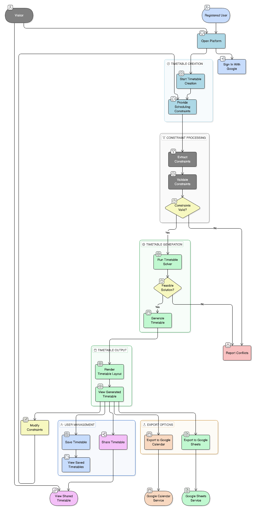

# Use Case Diagram — Timetable3o

## Actors

* Visitor (unregistered user)
* Registered User
* System (AI + Solver components)
* External Services (Google Calendar / Google Sheets)

---

## Visitor Use Cases

* Open platform
* Create timetable session
* Provide scheduling constraints via chat interface
* View generated timetable
* Modify constraints and regenerate timetable
* Access shared timetable links

Visitors can interact with the system without creating an account, but their timetables are not permanently stored.

---

## Registered User Use Cases

* Sign in using Google account
* Create and manage timetables
* Regenerate timetables with updated constraints
* Save timetables
* Share timetable via public link
* Export timetable to Google Calendar
* Export timetable to Google Sheets
* View previously created timetables

Registered users have additional persistence and export capabilities.

---

## System Use Cases

* Extract structured constraints from user input
* Validate constraint completeness
* Invoke timetable solver
* Generate timetable if feasible
* Detect and report conflicts if infeasible
* Render timetable in calendar-style view
* Validate manual modifications (future feature)

---

## External Service Use Cases

* Receive timetable data for export
* Create calendar events or spreadsheet entries

---

## Notes

The system is designed to support both anonymous usage for quick timetable generation and authenticated usage for saving, exporting, and sharing schedules.