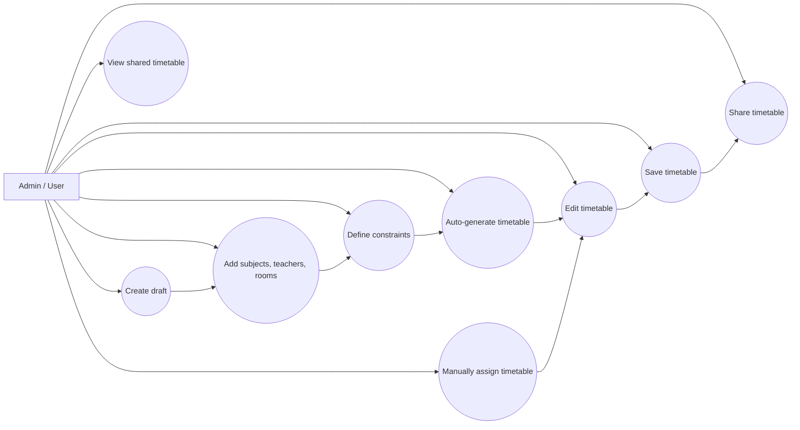

# Use Case Diagram

```mermaid
flowchart LR
    U[Admin / User]

    UC1((Create draft))
    UC2((Add subjects, teachers, rooms))
    UC3((Define constraints))
    UC4((Manually assign timetable))
    UC5((Auto-generate timetable))
    UC6((Edit timetable))
    UC7((Save timetable))
    UC8((Share timetable))
    UC9((View shared timetable))

    U --> UC1
    U --> UC2
    U --> UC3
    U --> UC4
    U --> UC5
    U --> UC6
    U --> UC7
    U --> UC8
    U --> UC9

    UC1 --> UC2
    UC2 --> UC3
    UC3 --> UC5
    UC5 --> UC6
    UC4 --> UC6
    UC6 --> UC7
    UC7 --> UC8
```

## Summary
Primary actor:
- Admin / User

Main use cases:
- create a new draft
- add timetable entities such as subjects, teachers, sections, and rooms
- define scheduling constraints
- build timetable manually in the grid
- auto-generate timetable using solver
- edit generated or manual timetable
- save timetable state
- publish/share timetable by link
- view a shared timetable in read-only mode
